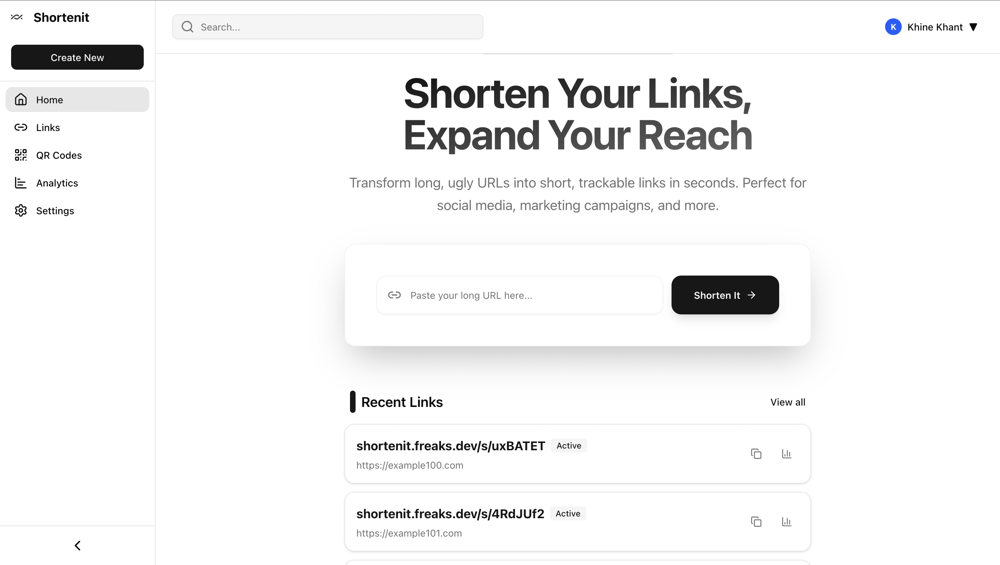

# ShortenIt Frontend

ShortenIt is a modern, premium URL shortening platform designed to provide lightning-fast link management, deep analytics, and seamless QR code generation. Built with the latest web technologies, it offers a slick, responsive user interface with a focus on performance and user experience.

 <!-- Use a real screenshot here if available -->

## ✨ Features

- **🚀 Instant URL Shortening**: Create short, memorable links in seconds.
- **📊 Comprehensive Analytics**: Visualize link performance with interactive charts (clicks over time, device distribution, etc.) using Recharts.
- **📱 QR Code Generator**: Instantly generate and download QR codes for your shortened links.
- **🎨 Premium UI/UX**: A beautiful, glassmorphism-inspired interface built with Tailwind CSS and Framer Motion.
- **🌙 Dark Mode Support**: Fully optimized light and dark themes using `next-themes`.
- **⚡ High Performance**: Powered by Next.js 16 and React 19 for optimal speed and SEO.

## 🛠️ Tech Stack

- **Framework**: [Next.js 16](https://nextjs.org/) (App Router)
- **Language**: [TypeScript](https://www.typescriptlang.org/)
- **Styling**: [Tailwind CSS v4](https://tailwindcss.com/)
- **UI Components**: [Radix UI](https://www.radix-ui.com/)
- **Icons**: [Lucide React](https://lucide.dev/)
- **Charts**: [Recharts](https://recharts.org/)
- **Utilities**: `clsx`, `tailwind-merge`

## 🚀 Getting Started

Follow these steps to get the project running locally on your machine.

### Prerequisites

- [Node.js](https://nodejs.org/) (v18 or higher recommended)
- [pnpm](https://pnpm.io/) (recommended) or npm/yarn

### 1. Clone the Repository

```bash
git clone https://github.com/knsxw/shortenit-frontend.git
cd shortenit-frontend
```

### 2. Install Dependencies

```bash
pnpm install
# or
npm install
```

### 3. Configure Environment Variables

Create a `.env` file in the root directory and add the following variables:

```env
# The base URL of your ShortenIt Backend API
NEXT_PUBLIC_API_BASE_URL=http://localhost:8080
```

> **Note**: Ensure your backend service is running and accessible at the specified URL. You can check backend repository [here](https://github.com/Shortenit/shortenit-backend).

### 4. Run the Development Server

```bash
pnpm dev
# or
npm run dev
```

Open [http://localhost:3000](http://localhost:3000) with your browser to see the result.

## 📂 Project Structure

```bash
.
├── app/                  # Next.js App Router pages and layouts
│   ├── links/            # Link management pages
│   ├── qrcodes/          # QR code generation pages
│   ├── settings/         # User settings
│   └── page.tsx          # Home/Dashboard page
├── components/           # Reusable UI components
│   ├── ui/               # Radix/Base UI components (buttons, inputs)
│   └── ...               # Feature-specific components
├── hooks/                # Custom React hooks
├── lib/                  # Utility functions and API helpers
├── public/               # Static assets (images, fonts)
└── styles/               # Global styles
```

## 🐳 Docker Support

This project includes a `Dockerfile` for containerized deployment.

To build and run with Docker:

```bash
# Build the image
docker build -t shortenit-frontend .

# Run the container
docker run -p 3000:3000 shortenit-frontend
```

## 🤝 Contributing

Contributions are welcome! Please feel free to submit a Pull Request.

1. Fork the project
2. Create your feature branch (`git checkout -b feature/AmazingFeature`)
3. Commit your changes (`git commit -m 'Add some AmazingFeature'`)
4. Push to the branch (`git push origin feature/AmazingFeature`)
5. Open a Pull Request

## 📄 License

This project is licensed under the MIT License - see the [LICENSE](LICENSE) file for details.

## 💻 Author

#### Khine Khant

---

Made with ❤️ for the Shortenit project

